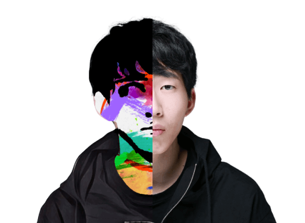

  

<h1 align="center">&nbsp;안녕하세요 제 이름은 호민 입니다.</h1>
<h3 align="center">Front end developer | Web publisher</h3>

  <em>
  안녕하세요 제 이름은 호민입니다. 저는 햄스터 한 마리, Macbook Air M1, Nintendo Switch, 여자친구와 함께 경기도 부천시 원룸 오피스텔에 살고 있습니다. 저는 2022년 1월부터 웹퍼블리셔로 일하며 경험을 쌓기 시작했고 이제는 반응형 웹, 웹 표준, 웹 접근성을 바탕으로 HTML, CSS, Javascript를 능숙하게 다룰 수 있습니다.
  </em> 
   
   <b><i>일 하고 싶을 때 일 하고 놀고 싶을 때 놀고 싶어요</i></b> 

&nbsp;**_저는..._**

✔ 2021년에 UI/UX 디자인 과정(6개월)을 수료했어요.  
✔ 2022년에 웹퍼블리셔로 일하기 시작했어요. 
✔ 2023년에 프론트엔드 개발자로 일하기 시작했어요. 
✔ 한국 방송통신대학교 컴퓨터과학과 3학년이에요. 

  

 &nbsp;<i><b>GitHub Stats</b></i>

&nbsp;

